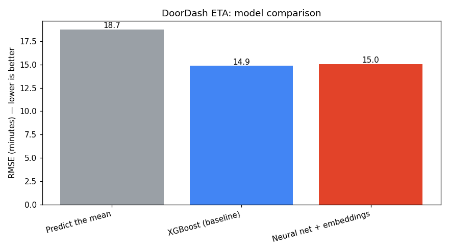

# 🚗 DoorDash ETA Prediction

> Predicting food-delivery duration — **with a calibrated uncertainty range** — on 197k real DoorDash orders. A hands-on rebuild of the ideas in DoorDash's production ETA engineering blog.

<p>
  
  
  
  
  
</p>

---

## 📌 What & why

When you order food, the app promises *"arrives in 35 min."* Getting that number right is a real, money-on-the-table ML problem: DoorDash handles **2 billion orders a year**, and a wrong ETA erodes customer trust.

This project takes DoorDash's **own public take-home dataset** and rebuilds a working slice of the system they describe in their engineering blog — from raw data to a deployed demo — so the whole ML lifecycle is on display, not a toy model.

**Task:** predict `delivery_duration_seconds = actual_delivery_time − created_at`, i.e. total seconds from order placed to delivered.

## 🎯 Results (time-based train/test split, 39k held-out orders)

| Model | RMSE | MAE | Notes |
|---|---:|---:|---|
| Predict the mean | 18.73 min | 13.91 min | the "do nothing smart" floor |
| DoorDash's own partial estimate | 39.43 min | 35.06 min | their 2 stage-estimates only cover part of the trip |
| **XGBoost (baseline)** | **14.85 min** | **10.65 min** | 🏆 best — 21% better than the floor |
| Neural net + embeddings | 15.04 min | 10.71 min | deep learning w/ embeddings — effectively a tie |

> **Key finding:** the neural net *matched* but did not beat gradient boosting. On medium-size tabular data (~158k rows) trees are typically at or near the ceiling; the embedding/deep-learning approach DoorDash uses pays off at their scale (billions of orders, millions of stores, rich real-time signals). Knowing **which model suits which scale** was the most useful lesson from this project — so both are kept here rather than quietly dropping the one that lost.

**Probabilistic forecast:** three quantile models (p10 / p50 / p90) give a *range* instead of a single number — e.g. *"38 min, likely 27–55 min."* The [p10, p90] band is **calibrated: 76.9% actual coverage vs. an 80% target.**



## 🧠 Approach — mapped to DoorDash's engineering blog

DoorDash's post rests on four ideas. This repo demonstrates each on real data:

| DoorDash's idea | How it's implemented here |
|---|---|
| **Embeddings** for high-cardinality categoricals (they have millions of stores) | `store_id` has 6,743 values → one-hot would explode → a PyTorch **embedding table** per categorical (`src/train_nn.py`) |
| **Dasher undersupply** is the biggest driver | engineered `busy_ratio`, `orders_per_dasher`, `free_dashers` from the supply/demand columns |
| **Delivery = a sum of stages** | combined DoorDash's own `estimated_order_place_duration` + `estimated_store_to_consumer_driving_duration` |
| **Probabilistic forecasting** (they use a Weibull distribution) | a simpler, honest version: **quantile regression** for a calibrated p10–p90 band |

## 🔬 What the data showed (EDA)

- **Long right tail** — median 44 min, but the 99.9th percentile is 165 min. Not a bell curve (which is exactly why DoorDash used a Weibull model).
- **Time-of-day matters** — clear meal-time rush patterns.
- **Undersupply → longer deliveries** — visible directly in the data.
- **No single feature dominates** — the strongest correlation with duration is only +0.24, which is *the* argument for a model that combines many weak signals rather than a simple formula.

Charts are saved to `figures/` by `src/eda.py`.

## 🗂️ Project structure

```
doordash-eta-prediction/
├── data/historical_data.csv      # 197k orders (downloaded — see below)
├── src/
│   ├── data.py                   # load, build target, clean
│   ├── features.py               # feature engineering (the blog's blueprint)
│   ├── eda.py                    # Phase 1 — exploration + charts
│   ├── train_baseline.py         # Phase 3 — XGBoost baseline
│   ├── train_quantiles.py        # Phase 5 — probabilistic p10/p50/p90
│   ├── train_nn.py               # Phase 4 — embedding neural net (PyTorch)
│   └── evaluate.py               # consolidated comparison + chart
├── app/                          # FastAPI demo (custom UI, live status)
│   ├── app.py
│   └── requirements.txt
├── models/                       # saved models + metrics
├── figures/                      # saved charts
├── Dockerfile                    # slim, torch-free serving image
├── run_app.py                    # local launcher (uvicorn on :8000)
└── requirements.txt
```

## ▶️ How to run

**1. Install**
```bash
pip install -r requirements.txt
```

**2. Get the data** (`historical_data.csv`, DoorDash's public take-home dataset)
```bash
python -c "import urllib.request; urllib.request.urlretrieve('https://cdn.jsdelivr.net/gh/js3lliott/doordash_delivery_prediction@main/data/historical_data.csv','data/historical_data.csv')"
```
(or download it from Kaggle: *DoorDash ETA Prediction*.)

**3. Explore & train**
```bash
python src/eda.py              # charts -> figures/
python src/train_baseline.py   # XGBoost baseline
python src/train_quantiles.py  # p10/p50/p90 range models
python src/train_nn.py         # embedding neural net
python src/evaluate.py         # final comparison table + chart
```

**4. Run the demo**
```bash
python run_app.py              # -> http://localhost:8000
```

## 🛠️ Tech stack

pandas · scikit-learn (`TargetEncoder`, pipelines) · **XGBoost** (baseline + quantile regression) · **PyTorch** (embedding MLP) · **FastAPI** (demo) · matplotlib

## 🙏 Credits

- Data: DoorDash's public delivery-duration take-home dataset (early-2015, historical).
- Inspiration: DoorDash Engineering — [*Precision in Motion: Deep learning for smarter ETA predictions*](https://careersatdoordash.com/blog/deep-learning-for-smarter-eta-predictions/).

This is an independent learning project and is not affiliated with DoorDash.

## 📄 License

MIT
